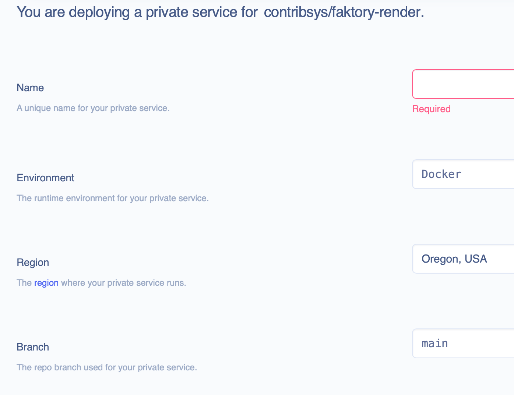

## Deploying Faktory to Render.com

[render.com](https://render.com) is a SaaS which makes it really easy to deploy custom
Docker-based services around the world with a few clicks.

1. Sign up for render.com.
2. On your Dashboard, select "New Private Service".
3. Paste in the URL for this repo:
   https://github.com/contribsys/faktory-render and click the box that
appears.

4. Customize it:
  - Enter a unique name for your Faktory server: "faktory", "foobar-faktory", etc.
  - Select an appropriate region "near" your app.
  - Notice you can set ENV variables or secrets files, useful for
    FAKTORY_LICENSE if you upgrade to Faktory Pro or Enterprise.
  - Select an appropriate instance size and create a persistent disk for
    your data.
  - Click "Create Private Service". You should have a live Faktory
    instance in a minute. Both ports should be accessible to your app
    running in Render.

### Limitations

Unfortunately private services are just that: private. You can't use a
Faktory service deployed to render.com with a generic app deployed in AWS
because there is no access to the service via public network.
If this changes, I will update this section with details.
